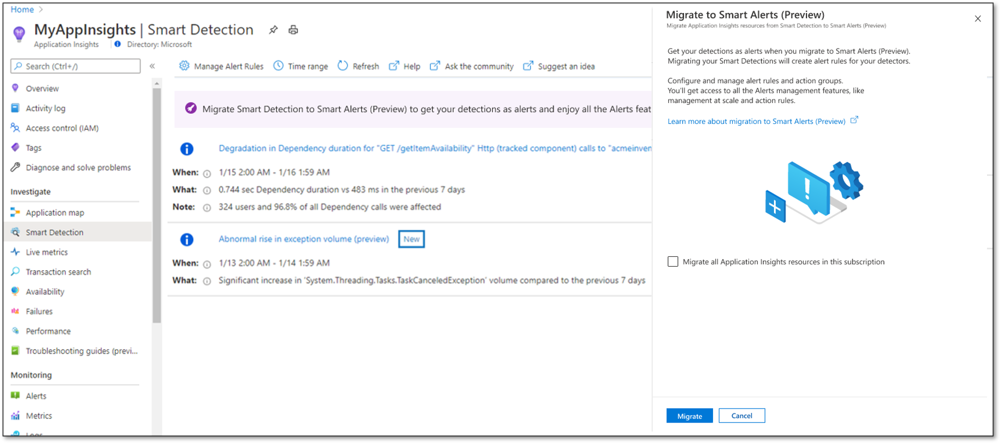
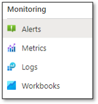

# Migrate Azure Monitor Application Insights Smart Detection to Smart Alerts (Preview)

## Overview

This guide will walk you through the process of migrating Application Insights Smart Detection to Smart Alerts. The migration will create alert rules for the different Smart Alerts detectors. Once created, you can manage and configure these rules just like any other Azure Monitor alert rules. You can also configure action groups for these rules, thus enabling multiple methods of taking actions or triggering notification on new detections.

You can view Smart Alert detections from the alerts you receive, and within the Azure portal alerts blade. In addition, you can still see them in Application Insights Smart Detection blade.

> [!NOTE]
> Migration of Smart Detection to Smart Alerts is currently available for a private, invitation-only preview. Not all of the capabilities described below may be fully functional in the private preview version. If you are interested to participate in the private preview, please contact smart-alert-feedback@microsoft.com.

## Benefits of migration to Smart Alerts

Smart Alerts allow you to take advantage of the full capabilities of Azure Monitor Alerts, including:

* Smart Alert rules allow you to conveniently manage your Smart Detection alerts at scale using Azure Monitor alerts experience and API.
* [Action groups](action-groups.md) allow you to configure multiple types of notifications and actions which will be triggered when an alert is fired. This includes notification by email, SMS, voice call or push notifications, and actions such as secure webhook, Logic App, automation runbook and more. Action groups further support management at scale by allowing you to configure actions once and use them across multiple alert rules
* [Action Rules](https://docs.microsoft.com/azure/azure-monitor/platform/alerts-action-rules?tabs=portal) help you define or suppress actions at any Azure Resource Manager scope (Azure subscription, resource group, or target resource). They have various filters that help you narrow down the specific subset of alert instances that you want to act on.

## Migrated Smart Detection capabilities

As part of migrating an Application Insights resource, a new set of Smart Alert rules will be created, one rule for each of the migrated Smart Detection capabilities. The following table maps the pre-migration Smart Detection capabilities to post-migration Smart Alert rules:

| Smart Detection rule name  *                       | Smart Alert rule name ** |
| -------------------------                          | ------------------------------ |
| Degradation in server response time                | Response latency degradation - \<Application Insights resource name\>  |
| Degradation in dependency duration                 | Dependency latency degradation - \<Application Insights resource name\>|
| Degradation in trace severity ratio (preview)      | Trace severity degradation - \<Application Insights resource name\>|
| Abnormal rise in exception volume (preview)        | Exception anomalies - \<Application Insights resource name\>|
| Potential memory leak detected (preview)           | Potential memory leak - \<Application Insights resource name\>|
| Slow page load time                                | *discontinued* \*\*\*        |
| Slow server response time                          | *discontinued* \*\*\*       |
| Long dependency duration                           | *discontinued* \*\*\*       |
| Potential security issue detected (preview)        | *discontinued* \*\*\*       |
| Abnormal rise in daily data volume (preview)       | *discontinued* \*\*\*       |

\* Name of rule as appears in Smart Detection Settings blade  
\*\* Name of new Smart Alert rule after migration  
\*\*\* These Smart Detection capabilities will not be converted to alerts, and will no longer be supported for this resource once its migration is completed. This is due to low usage and re-assessment of detection effectiveness 

The migration to Smart Alerts does not change the algorithmic design and behavior of Smart Detection. You should expect Smart Alerts to perform in an similar manner to respective Smart Detection capabilities.

Also, note that the migration to Smart Alerts need to be applied to each Application Insights resource separately. For Application Insights that were not explicitly migrated, Smart Detection will continue to work as before.

## Executing Smart Detection migration process

### Migrate your Smart Detection using the Azure portal

You can apply the migration of your Smart Detection to alerts on a specific Application Insights resource at a time.

To migrate an Application Insights resource Smart Detection to alerts, take the following steps:

1. select **Smart Detection** under the **Investigate** heading in your Application Insights resource left-side menu.

2. Click on the banner reading **"Migrate Smart Detection to Smart Alerts (preview)**. The migration dialog will be opened.


3. Select **Migrate** to start the migration process.



After the migration, new Smart Alert rules will be created for your Application Insight resource, as explained above. 
As part of the migration process, each new Smart Alert rule is automatically configured with an action group. The configured action group for each rule depends on the notification settings for the equivalent Smart Detection rule prior to the migration:

* If you haven't previously changed the default notification for a Smart Detection rule, or the rule didn’t have notification at all (preview detectors), the respective alert rule will be configured with the “Application Insights Smart Detection” action group. If an action group with that name already exists in this subscription, the existing action group will be used. If an action group with that name does not exist, it will be created with “Email Azure Resource Manager Role” actions, sending notification to your Azure Resource Manager Monitoring Contributor and Monitoring Reader users.
* If you previously did change the default email notification for the equivalent detector, then an action group called “Application Insights Smart Detection Custom” will be created, with an email action sending notification to the previously configured email addresses.

### Migrate your Smart Detection using Azure CLI

You can initiate Smart Detection migration to alerts using the following Azure CLI command. This will trigger automated, pre-configured migration process, creating the alert rule names and action groups as described in this document.

```azurecli
az rest --method POST --uri /subscriptions/{subscriptionId}/providers/Microsoft.AlertsManagement/migrateFromSmartDetection?api-version=2021-01-01-preview --body @body.txt
```

Where body.txt should include:

```json
{
              "scope": [
"/subscriptions/{subscriptionId}/resourceGroups/{resourceGroupName} /providers/microsoft.insights/components/{resourceName} "
              ],
              "actionGroupCreationPolicy" : "{Auto/Custom}",
              "customActionGroupName" : "{actionGroupName}"           
}
```

**ActionGroupCreationPolicy** selects the policy for migrating the email settings in the Smart Detection rules into action groups. Allowed values are **'Auto'** for using the default action groups as described in this document, or **'Custom'**, for creating all alert rules with the action group specified in **'customActionGroupName'**. If **ActionGroupCreationPolicy** is not specified, 'Auto' policy is used.

## Viewing your Smart Alerts after the migration

Following the migration process, you can view your Smart Detection alerts by selecting the Alerts entry in your Application Insights resource left-side menu. Select **Signal Type** to be **Smart Detector** in order to filter and present only the Smart Detector alert rules. You can select an alert to see its detection details.


In addition, you can still see the available detections in the Smart Detections feed of your Application Insights resource.


## Managing Smart Alert rules settings after the migration

### Managing Smart Alert rules settings using the Azure portal

After the migration is completed, you access the new Smart Alert rules in your Application Insight resource, in a similar way to other alert rules defined for the resource:

1. select **Alerts** under the **Monitoring** heading in your Application Insights resource left-side menu.



2. Select **Manage Alert Rules**


3. Select **Signal Type** to be **Smart Detector** in order to filter and present the Smart Detector alert rules.


### Enabling / disabling Smart Alert rules 

As with any Azure Monitor alert rules, Smart Alert rules can be enabled or disabled through the portal UI, or programmatically.

Note that if a specific Smart Detection capability was disabled prior to the migration, the respective alert rule will be disabled as well.

### Configuring action group for your Smart Alert rules

You can create and manage action groups for the new Smart Alert rules just like for any other Azure Monitor alert rule. You can add more actions, modify, or delete the action groups created by the migration.

### Managing Smart Alert rule settings using Azure Resource Manager templates

After completing the migration of Smart Detection to alerts, you can use Azure Resource Management templates to configure settings for Smart Alerts settings.

This Azure Resource Manager template example demonstrates configuring an **Response Latency Degradation** alert rule in an **Enabled** state with a severity of 2.

```json
{
    "$schema": "https://schema.management.azure.com/schemas/2015-01-01/deploymentTemplate.json#",
    "contentVersion": "1.0.0.0",
    "resources": [
        {
            "type": "microsoft.alertsmanagement/smartdetectoralertrules",
            "apiVersion": "2019-03-01",
            "name": "Response Latency Degradation - my-app",
            "location": "global", 
            "properties": {
                  "description": "Response Latency Degradation notifies you of an unusual increase in latency in your app response to requests.",
                  "state": "Enabled",
                  "severity": "2",
                  "frequency": "PT1M",
                  "detector": {
                  "id": "RequestPerformanceDegradationDetector"
                  },
                  "scope": ["/subscriptions/00000000-1111-2222-3333-444444444444/resourceGroups/MyResourceGroup/providers/microsoft.insights/components/my-app"],
                  "actionGroups": {
                        "groupIds": ["/subscriptions/00000000-1111-2222-3333-444444444444/resourcegroups/MyResourceGroup/providers/microsoft.insights/actiongroups/MyActionGroup"]
                  }
            }
        }
    ]
}
```

> [!NOTE]
> Smart Alerts are a global service therefore rule location is created on the global location.

> [!NOTE]
> "id" property should change according to the specific detector configured. Value must be one of: **FailureAnomaliesDetector**, **RequestPerformanceDegradationDetector**, **DependencyPerformanceDegradationDetector**, **ExceptionVolumeChangedDetector**, **TraceSeverityDetector**, **MemoryLeakDetector**

> [!NOTE]
> After completion of migration, Smart Detector settings must be configured using Smart Alerts templates, and can no longer be configured using the Application Insights ARM template, as described [here](https://docs.microsoft.com/azure/azure-monitor/app/proactive-arm-config#smart-detection-rule-configuration).

## Next Steps
