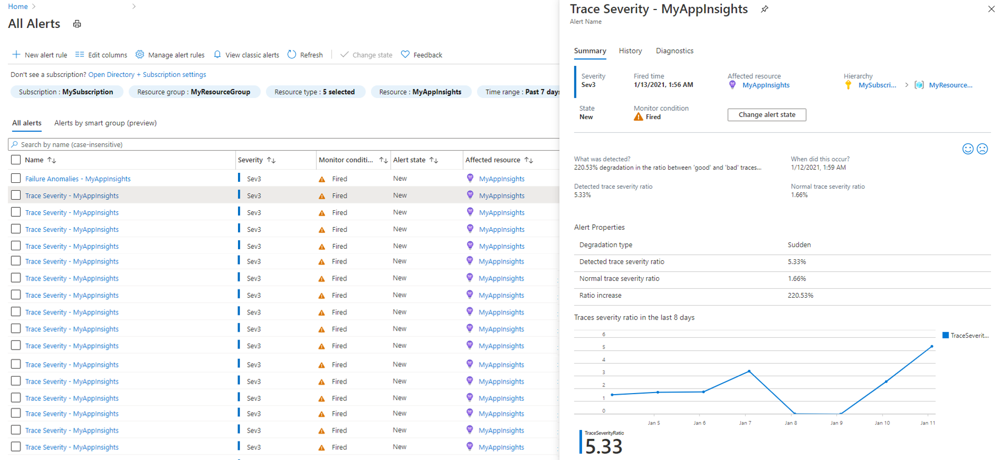
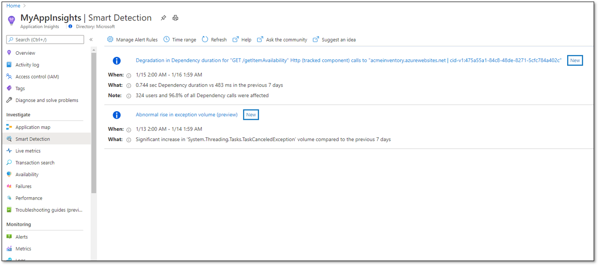
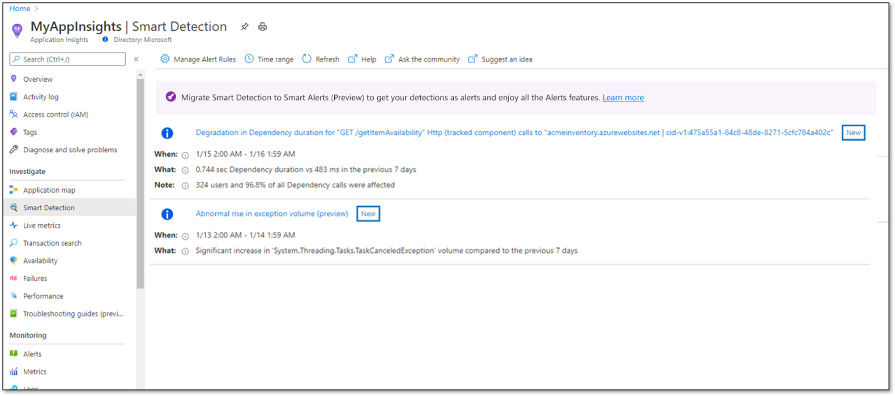

# Migrate Azure Monitor Application Insights Smart Detection to Smart Alerts (Preview) 

## Overview
This guide will walk you through the process of migrating Application Insights Smart Detection to Smart Alerts. The migration will create alert rules for the different Smart Alerts detectors. Once created, you can manage and configure these rules just like any other Azure Monitor alert rules. You can also configure action groups for these rules, thus enabling multiple methods of taking actions or triggering notification on new detections.

You can view Smart Alert detections from the alerts you receive, and within the Azure portal alerts blade. In addition, you can still see them in Application Insights Smart Detection blade. 

> [!NOTE]
> Migration of Smart Detection to Smart Alerts is currently available for a private, invitation-only preview. Not all of the capabilities described below may be fully functional in the private preview version. If you are interested to participate in the private preview, please contact smart-alert-feedback@microsoft.com.

## New capabilities

Alerts-based Smart Detection allows you to take advantage of the full capabilities of Azure Monitor Alerts including:

* Smart Alert rules allow you to conveniently manage your Smart Detection alerts at scale using Azure Monitor alerts experience and API.
* [Action groups](https://docs.microsoft.com/azure/azure-monitor/platform/action-groups) allows you to configure multiple types of notifications and actions which will be triggered when an alert is fired. This includes notification by email, SMS, voice call or push notifications, and actions such as secure webhook, Logic App, automation Runbook and more. Action groups further support management at scale by allowing you to configure actions once and use them across multiple alert rules
* [Action Rules](https://docs.microsoft.com/azure/azure-monitor/platform/alerts-action-rules?tabs=portal) help you define or suppress actions at any Azure Resource Manager scope (Azure subscription, resource group, or target resource). They have various filters that help you narrow down the specific subset of alert instances that you want to act on. 

## Supported Detectors 

The following Smart Detection capabilities are converted to alerts by the migration process, each with it's own alert rule:
* Response latency degradation
* Dependency latency degradation
* Trace severity degradation
* Exception anomalies
* Potential memory leak

The following Smart Detection capabilities will not be converted to alerts and will no longer be supported once you complete the migration:
* Slow page load time
* Slow server response time
* Long dependency duration
* Potential security issue detected (preview)
* Abnormal rise in daily data volume (preview)


## New alert rules

For each migrated Application Insight resource, a new alert rule is created for each one of the migrated detectors. If a specific smart detector was disabled prior to the migration, the created alert rule will be disabled as well. 

The names of the new created alert rules will be the following:
* **Response Latency Degradation - \<target resource name\>**
* **Dependency Latency Degradation - \<target resource name\>**
* **Trace Severity Degradation - \<target resource name\>**
* **Exception Anomalies - \<target resource name\>**
* **Potential Memory Leak - \<target resource name\>**

Where \<target resource name\> is the name of the migrated Application Insights resource.

To see your new alert rules after the migration is completed:

1. select **Alerts** under the **Monitoring** heading in your Application Insights resource left-side menu.


2. Select **Manage Alert Rules**


3. Select **Signal Type** to be **Smart Detector** in order to filter and present the Smart Detector alert rules.


## Action group configuration

As part of the migration process, each new smart alert rule is automatically configured with an action group. The configured action group for each rule depends on the notification configuration for the equivalent smart detector prior to the migration.
* If you didn’t previously change the default notification for a detector, or the detector didn’t have notification at all (preview detectors), the respective alert rule will be configured with the “Application Insights Smart Detection” action group. If an action group with that name already exists in this subscription, the existing action group will be used. If an action group with that name does not exist, it will be created with “Email Azure Resource Manager Role” actions, sending notification to your Azure Resource Manager Monitoring Contributor and Monitoring Reader users.
* If you previously did change the default email notification for the equivalent detector, then an action group called “Application Insights Smart Detection Custom” will be created, with an email action sending notification to the previously configured email addresses.

> [!NOTE]
> If you are using the programmatic interface to trigger Smart Detection migration, you can create your Smart Alert rules with a custom (existing) action group. See below for more details.

Note that once the new alert rules are created, you can configure different action groups to the Smart Detection alert rules. You can also add more actions, modify, or delete the action groups created by the migration.


## Viewing your Smart Detection Alerts

Following the migration process, you can see view your Smart Detection alerts by selecting the Alerts entry in your Application Insights resource left-side menu. Select **Signal Type** to be **Smart Detector** in order to filter and present only the Smart Detector alert rules. You can select an alert to see its detection details.



    
In addition, you can still see the available detections in the Smart Detections feed of your Application Insights resource.



## Migrate your Smart Detection using the Azure portal
You can migrate your Smart Detection to alerts on a specific Application resource at a time. 

To migrate an Application Insights resource Smart Detection to alerts, take the following steps:

1. select **Smart Detection** under the **Investigate** heading in your Application Insights resource left-side menu.

2. Click on the banner reading **"Migrate Smart Detection to Smart Alerts (preview)**. The migration dialog will be opened.



3. Select **Migrate** to start the migration process.


## Programmatic migration

### Azure PowerShell - trigger pre-configured migration
You can initiate Smart Detection migration to alerts using the following commands. This will trigger automated, pre-configured migration creating the alert rule names and action groups as described in the is document.

```powershell
az rest --method POST --uri /subscriptions/{subscriptionId}/providers/Microsoft.AlertsManagement/migrateFromSmartDetections?api-version=2020-11-01 --body @body.txt
```
Where body.txt should include:
```
{
              "scope": [
"/subscriptions/{subscriptionId}/resourceGroups/{resourceGroupName} /providers/microsoft.insights/components/{resourceName} "
              ],
              "actionGroupCreationPolicy" : "{Default/Default/Custom}",
              "customActionGroupName" : "{actionGroupName}",
}
```

### Customized migration using Azure Resource Manager template
You can also initiate Smart Detection migration to alerts using an Azure Resource Manager template. Resource Manager templates provide better control by allowing you to customize the properties of the created alert rules, such as the alert rule name and the action groups to be used by each rule.

To initiate a successful migration to alerts, you need to deploy an arm template for creating an alert rule for each of the supported detectors, and then another template for setting the respective property of the target Application Insights resource in order to mark the migration as completed.

Here is the sequence of templates to be deployed in order to complete a successful migration.

1. Template for Response Latency Degradation alert rule


The following templates should 

